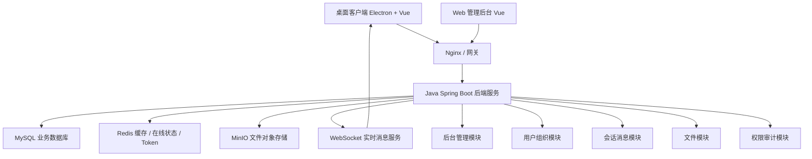
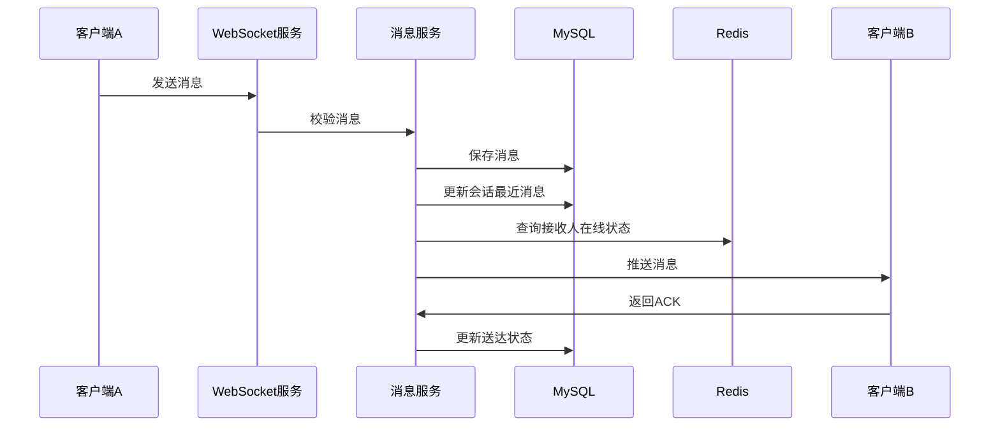
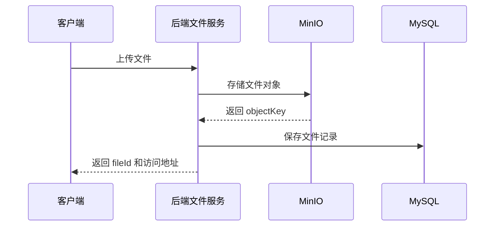
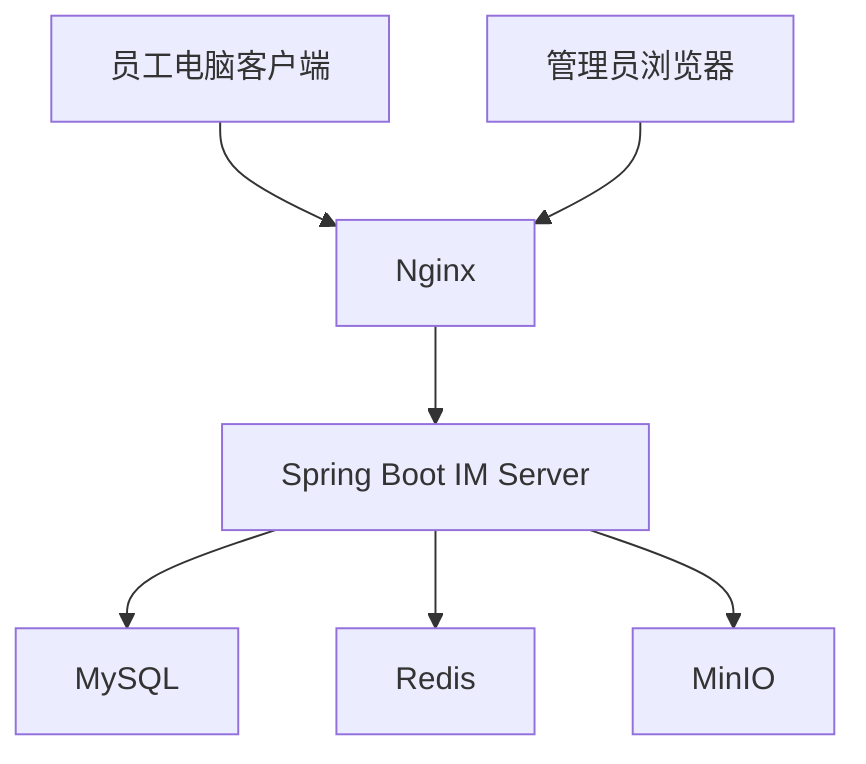
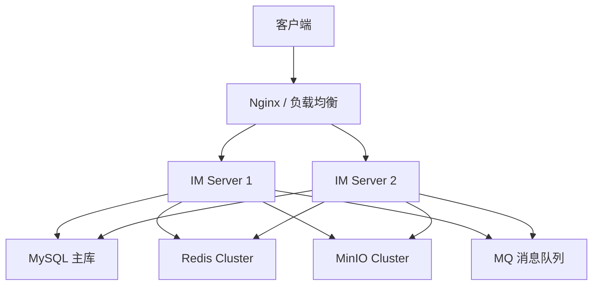

# 绘语 ArtTalk 项目前后端技术架构设计文档

## 1. 文档说明

本文档用于整理绘语 ArtTalk 项目的前端、后端、数据库、实时通信、文件存储、部署与后期扩展技术架构。

当前架构设计目标：

- 支持企业内部即时通讯；
- 支持桌面客户端、后台管理端；
- 支持单聊、群聊、图片、文件、离线消息；
- 支持企业组织架构、用户权限、后台管理；
- 支持后期扩展 TCP 长连接、移动端、消息审计、AI 助手等能力。

---

## 2. 项目整体定位

本项目建议定位为：

> 企业内网 IM + 管理后台 + 文件传输 + 组织通讯录 + 权限管理系统

前期主要面向 200 人左右的企业内部使用场景，不建议一开始就采用复杂微服务架构，而是采用：

> 单体模块化后端架构 + Electron 桌面客户端 + Vue 管理后台 + WebSocket 实时通信

---

## 3. 整体技术架构

### 3.1 总体架构图



### 3.2 架构核心原则

| 原则 | 说明 |
|---|---|
| 前后端分离 | 前端负责界面与交互，后端负责业务和数据 |
| 单体模块化优先 | 前期不直接上微服务，降低开发和部署成本 |
| WebSocket 优先 | 第一阶段使用 WebSocket 实现实时通信 |
| TCP 后期扩展 | 用户量扩大或性能要求提高后，再扩展 TCP 长连接 |
| MySQL 主业务库 | 用户、组织、会话、消息等核心数据进入 MySQL |
| Redis 做缓存 | 在线状态、Token、未读数、临时状态使用 Redis |
| MinIO 存文件 | 图片、头像、聊天附件等使用对象存储 |
| 后期平滑扩展 | 架构预留消息队列、搜索引擎、分布式部署能力 |

---

## 4. 前端技术架构

## 4.1 前端整体划分

前端建议拆分为两个独立项目：

| 前端项目 | 用途 | 推荐技术 |
|---|---|---|
| IM 桌面客户端 | 员工聊天、通讯录、文件收发 | Electron + Vue 3 + TypeScript |
| 后台管理端 | 用户管理、部门管理、权限、审计 | Vue 3 + TypeScript + 管理后台 UI 框架 |

---

## 4.2 IM 桌面客户端技术栈

| 层级 | 技术 |
|---|---|
| 桌面壳 | Electron |
| 前端框架 | Vue 3 |
| 开发语言 | TypeScript |
| 构建工具 | Vite |
| 状态管理 | Pinia |
| 路由管理 | Vue Router |
| 网络请求 | Axios / Fetch |
| 实时通信 | WebSocket |
| 本地缓存 | IndexedDB / SQLite |
| UI 组件 | 自研组件 + Element Plus / Naive UI 辅助 |
| 图标管理 | SVG 图标本地管理 |
| 打包工具 | electron-builder |

---

## 4.3 IM 客户端页面结构

```text
im-client
├─ 登录页
│  ├─ 账号密码登录
│  ├─ 记住账号
│  └─ 自动登录
│
├─ 主界面
│  ├─ 左侧主导航
│  │  ├─ 消息
│  │  ├─ 通讯录
│  │  ├─ 收藏
│  │  ├─ 文件
│  │  └─ 设置
│  │
│  ├─ 会话列表
│  │  ├─ 单聊会话
│  │  ├─ 群聊会话
│  │  ├─ 未读数量
│  │  └─ 置顶 / 免打扰
│  │
│  ├─ 聊天窗口
│  │  ├─ 消息列表
│  │  ├─ 图片消息
│  │  ├─ 文件消息
│  │  ├─ 表情消息
│  │  ├─ 撤回消息
│  │  ├─ 回复消息
│  │  └─ 输入框
│  │
│  └─ 右侧信息栏
│     ├─ 群成员
│     ├─ 文件列表
│     └─ 会话设置
```

---

## 4.4 IM 客户端核心模块

| 模块 | 说明 |
|---|---|
| 登录模块 | 账号密码登录、Token 保存、自动登录 |
| WebSocket 模块 | 建立长连接、心跳、断线重连、消息接收 |
| 会话模块 | 会话列表、置顶、未读、最近消息 |
| 消息模块 | 文本、图片、文件、系统通知、撤回、已读 |
| 通讯录模块 | 部门、员工、好友 / 同事列表 |
| 文件模块 | 上传、下载、预览、传输进度 |
| 本地缓存模块 | 最近会话、本地消息缓存、草稿 |
| 设置模块 | 头像、昵称、声音提醒、快捷键 |
| 桌面能力模块 | 托盘、通知、开机启动、窗口控制 |

---

## 4.5 后台管理前端技术栈

| 层级 | 技术 |
|---|---|
| 框架 | Vue 3 |
| 语言 | TypeScript |
| 构建 | Vite |
| UI 框架 | Element Plus / Ant Design Vue |
| 状态管理 | Pinia |
| 网络请求 | Axios |
| 权限控制 | RBAC 前端路由权限 |
| 图表 | ECharts |

---

## 4.6 后台管理页面结构

```text
admin-web
├─ 登录页
├─ 工作台
├─ 用户管理
├─ 部门管理
├─ 角色权限管理
├─ 群组管理
├─ 消息审计
├─ 文件管理
├─ 系统配置
├─ 登录日志
└─ 操作日志
```

后台管理 UI 建议参考飞书、企业微信后台风格：

- 白色背景；
- 浅灰分区；
- 左侧导航；
- 顶部工具栏；
- 表格为主；
- 弹窗编辑；
- 抽屉详情页；
- 整体保持轻量、干净、企业级。

---

## 5. 后端技术架构

## 5.1 后端总体技术选型

后端建议采用：

```text
Java 21
Spring Boot
Spring Security
Spring WebSocket
MyBatis-Plus / MyBatis
MySQL
Redis
MinIO
Nginx
Docker Compose
```

---

## 5.2 后端架构模式

第一阶段建议采用：

> 单体模块化架构

也就是一个 Spring Boot 项目，内部按业务模块拆分。

优点：

| 优点 | 说明 |
|---|---|
| 开发简单 | 不需要维护多个服务 |
| 部署简单 | 一个后端服务即可运行 |
| 调试方便 | 本地开发成本低 |
| 适合中小规模 | 200 人左右企业 IM 足够使用 |
| 后期可拆分 | 后续可以按模块拆成微服务 |

---

## 5.3 后端模块划分

```text
im-server
├─ im-auth           登录认证模块
├─ im-user           用户模块
├─ im-org            组织部门模块
├─ im-friend         联系人模块，可选
├─ im-conversation   会话模块
├─ im-message        消息模块
├─ im-ws             WebSocket 长连接模块
├─ im-file           文件模块
├─ im-admin          后台管理模块
├─ im-permission     权限模块
├─ im-audit          审计日志模块
├─ im-common         公共工具模块
└─ im-infra          基础设施模块
```

---

## 6. 核心后端模块设计

## 6.1 登录认证模块

负责用户登录、Token、权限校验和登录状态管理。

### 主要功能

| 功能 | 说明 |
|---|---|
| 登录 | 账号密码登录 |
| Token | JWT Token 生成与校验 |
| 刷新登录 | Token 续期 |
| 退出登录 | 清除 Redis 在线状态 |
| 登录限制 | 密码错误次数限制 |
| 登录日志 | 记录 IP、设备、时间 |
| 权限信息 | 返回当前用户菜单与权限码 |

### 登录成功返回示例

```json
{
  "token": "xxxx",
  "userId": 10001,
  "nickname": "张三",
  "avatar": "https://xxx/avatar.png",
  "permissions": ["message:send", "file:upload"]
}
```

---

## 6.2 用户与组织模块

用于管理企业通讯录。

### 主要功能

| 功能 | 说明 |
|---|---|
| 用户管理 | 新增、编辑、禁用、删除用户 |
| 部门管理 | 树形部门结构 |
| 岗位管理 | 可选 |
| 通讯录 | 按部门展示员工 |
| 用户状态 | 在线、离线、忙碌、离开 |
| 头像昵称 | 个人资料维护 |

### 组织结构示例

```text
公司
├─ 美术部
│  ├─ 原画组
│  ├─ 3D组
│  └─ AIGC组
├─ 技术部
└─ 行政部
```

---

## 6.3 会话模块

用于管理单聊、群聊、最近会话。

### 主要功能

| 功能 | 说明 |
|---|---|
| 创建单聊 | 两个人之间创建会话 |
| 创建群聊 | 多人会话 |
| 会话列表 | 最近联系人列表 |
| 置顶会话 | pin |
| 免打扰 | mute |
| 未读数 | unread count |
| 最近消息 | last message |
| 群成员管理 | 添加、移除、群主、管理员 |

### 会话类型

| 类型值 | 类型 |
|---|---|
| 1 | 单聊 |
| 2 | 群聊 |
| 3 | 系统通知 |

---

## 6.4 消息模块

消息模块是整个 IM 系统的核心。

### 消息类型

| 类型 | 说明 |
|---|---|
| TEXT | 文本消息 |
| IMAGE | 图片消息 |
| FILE | 文件消息 |
| AUDIO | 语音消息，后期 |
| VIDEO | 视频消息，后期 |
| SYSTEM | 系统通知 |
| RECALL | 撤回消息 |
| REPLY | 回复消息 |
| CARD | 业务卡片，后期 |

### 消息状态

| 状态 | 说明 |
|---|---|
| SENDING | 发送中 |
| SENT | 已发送 |
| DELIVERED | 已送达 |
| READ | 已读 |
| FAILED | 发送失败 |
| RECALLED | 已撤回 |

### 消息发送流程



---

## 6.5 WebSocket 实时通信模块

WebSocket 模块负责客户端和服务端之间的实时消息通信。

### 主要功能

| 功能 | 说明 |
|---|---|
| 建立连接 | 客户端登录后建立 WebSocket |
| 鉴权 | 连接时校验 Token |
| 心跳 | ping / pong 保活 |
| 断线重连 | 客户端自动重连 |
| 在线状态 | Redis 记录在线用户 |
| 消息推送 | 服务端主动推送消息 |
| 多端同步 | 同一个账号多个客户端同步消息 |

### WebSocket 地址示例

```text
/ws/im?token=xxx
```

### WebSocket 消息格式建议

客户端发送：

```json
{
  "cmd": "MESSAGE_SEND",
  "seq": "client-msg-uuid",
  "fromUserId": 10001,
  "conversationId": 20001,
  "messageType": "TEXT",
  "content": {
    "text": "你好"
  },
  "timestamp": 1710000000000
}
```

服务端返回：

```json
{
  "cmd": "MESSAGE_ACK",
  "seq": "client-msg-uuid",
  "messageId": 90001,
  "status": "SENT",
  "timestamp": 1710000001000
}
```

### WebSocket 指令类型

```text
MESSAGE_SEND       发送消息
MESSAGE_ACK        消息确认
MESSAGE_RECEIVE    接收消息
MESSAGE_READ       已读回执
MESSAGE_RECALL     撤回消息
PING               心跳
PONG               心跳响应
ONLINE_STATUS      在线状态变更
```

---

## 6.6 文件模块

文件模块用于处理头像、聊天图片、聊天附件、群头像、表情包等。

建议使用 MinIO 作为对象存储。

### 文件上传流程



### 文件分类

| 类型 | 存储位置 |
|---|---|
| 用户头像 | MinIO |
| 聊天图片 | MinIO |
| 聊天文件 | MinIO |
| 群头像 | MinIO |
| 表情包 | MinIO |
| 临时文件 | MinIO，可设置清理策略 |

---

## 7. 数据库架构设计

## 7.1 数据存储分工

| 数据类型 | 推荐技术 |
|---|---|
| 用户、部门、权限 | MySQL |
| 会话、消息、群组 | MySQL |
| 在线状态 | Redis |
| Token / Session | Redis |
| 未读数缓存 | Redis |
| 文件本体 | MinIO |
| 文件元数据 | MySQL |
| 聊天记录搜索 | 后期可加 Elasticsearch / OpenSearch |

---

## 7.2 MySQL 核心表

第一阶段建议至少包含以下数据表：

```text
sys_user                    用户表
sys_dept                    部门表
sys_role                    角色表
sys_permission              权限表
sys_user_role               用户角色表

im_conversation             会话表
im_conversation_member      会话成员表
im_message                  消息表
im_message_read             消息已读表
im_file                     文件表

im_group                    群组表
im_group_member             群成员表
sys_login_log               登录日志表
sys_operation_log           操作日志表
```

---

## 7.3 消息表设计建议

```sql
CREATE TABLE im_message (
    id BIGINT PRIMARY KEY AUTO_INCREMENT COMMENT '消息ID',
    conversation_id BIGINT NOT NULL COMMENT '会话ID',
    sender_id BIGINT NOT NULL COMMENT '发送人ID',
    message_type VARCHAR(32) NOT NULL COMMENT '消息类型 TEXT/IMAGE/FILE',
    content JSON NOT NULL COMMENT '消息内容',
    status VARCHAR(32) DEFAULT 'SENT' COMMENT '消息状态',
    client_msg_id VARCHAR(64) COMMENT '客户端消息ID，用于去重',
    reply_msg_id BIGINT DEFAULT NULL COMMENT '回复的消息ID',
    is_recalled TINYINT DEFAULT 0 COMMENT '是否撤回',
    create_time DATETIME NOT NULL DEFAULT CURRENT_TIMESTAMP COMMENT '发送时间',
    update_time DATETIME NOT NULL DEFAULT CURRENT_TIMESTAMP ON UPDATE CURRENT_TIMESTAMP COMMENT '更新时间',
    INDEX idx_conversation_time (conversation_id, create_time),
    INDEX idx_sender_time (sender_id, create_time),
    UNIQUE KEY uk_client_msg (sender_id, client_msg_id)
) COMMENT='IM消息表';
```

---

## 8. 接口架构设计

## 8.1 REST API

普通业务接口走 HTTP REST API。

### 示例接口

```text
POST   /api/auth/login
POST   /api/auth/logout
GET    /api/users/me
GET    /api/depts/tree
GET    /api/conversations
POST   /api/conversations
GET    /api/messages/history
POST   /api/files/upload
GET    /api/admin/users
POST   /api/admin/users
```

---

## 8.2 WebSocket API

实时消息走 WebSocket。

```text
/ws/im?token=xxx
```

WebSocket 主要负责：

```text
MESSAGE_SEND       发送消息
MESSAGE_ACK        消息确认
MESSAGE_RECEIVE    接收消息
MESSAGE_READ       已读回执
MESSAGE_RECALL     撤回消息
PING               心跳
PONG               心跳响应
ONLINE_STATUS      在线状态变更
```

---

## 9. 部署架构设计

## 9.1 第一阶段部署方案

200 人左右企业内网环境，第一阶段可以使用一台服务器部署全部服务。



### 推荐部署方式

| 服务 | 部署方式 |
|---|---|
| Nginx | Docker / 本机安装 |
| Spring Boot | Jar 包 / Docker |
| MySQL | Docker / 独立安装 |
| Redis | Docker / 独立安装 |
| MinIO | Docker / 独立安装 |
| 前端管理端 | Nginx 静态文件 |
| Electron 客户端 | exe 安装包 |

---

## 9.2 后期扩展部署方案

当用户量扩大、需要多端同步、消息搜索、消息审计或高可用时，可以升级为分布式部署。



### 后期可增加组件

| 组件 | 用途 |
|---|---|
| RabbitMQ / Kafka | 消息异步投递、削峰 |
| Elasticsearch / OpenSearch | 聊天记录搜索 |
| Prometheus + Grafana | 服务监控 |
| Sentinel / Resilience4j | 限流熔断 |
| TCP Gateway | 自研 TCP 长连接网关 |
| SSO | 企业统一登录 |
| Jenkins / GitLab CI | 自动化部署 |

---

## 10. 开发阶段规划

## 10.1 第一阶段：MVP 基础版本

优先完成基础 IM 能力。

```text
1. 登录 / 退出
2. 用户管理
3. 部门通讯录
4. 单聊
5. 群聊
6. 文本消息
7. 图片消息
8. 文件消息
9. 离线消息
10. 后台用户管理
```

第一阶段所需技术：

```text
Vue + Electron + Spring Boot + MySQL + Redis + MinIO + WebSocket
```

---

## 10.2 第二阶段：体验增强

增加常用聊天体验功能。

```text
1. 消息撤回
2. 消息已读
3. 消息回复
4. 表情包
5. 会话置顶
6. 免打扰
7. 文件预览
8. 托盘通知
9. 自动更新
10. 登录日志和操作日志
```

---

## 10.3 第三阶段：企业能力增强

增加企业管理和安全能力。

```text
1. 消息审计
2. 敏感词过滤
3. 企业公告
4. 多端同步
5. 组织架构同步
6. 权限分级
7. 聊天记录搜索
8. 数据备份
9. 系统监控
```

---

## 10.4 第四阶段：高级扩展

后期根据实际使用情况扩展高级能力。

```text
1. TCP 长连接替代 WebSocket
2. 移动端 App
3. AI 助手
4. 群机器人
5. 音视频会议
6. 局域网文件极速传输
7. 多租户 SaaS 化
```

---

## 11. 当前推荐最终技术方案

## 11.1 前端方案

```text
IM 桌面客户端：
Electron + Vue 3 + TypeScript + Vite + Pinia + WebSocket

后台管理端：
Vue 3 + TypeScript + Vite + Element Plus / Ant Design Vue
```

---

## 11.2 后端方案

```text
Java 21
Spring Boot
Spring Security
Spring WebSocket
MyBatis-Plus
MySQL
Redis
MinIO
Nginx
Docker Compose
```

---

## 11.3 通信方案

```text
普通接口：HTTP REST API
实时消息：WebSocket
后期扩展：TCP 长连接
```

---

## 11.4 存储方案

```text
业务数据：MySQL
在线状态 / Token / 未读数：Redis
图片 / 文件 / 头像：MinIO
聊天记录：MySQL
聊天记录搜索：后期可加 Elasticsearch / OpenSearch
```

---

## 12. 一句话总结

本项目最稳妥的技术架构是：

> 前端用 Electron + Vue 做 QQ 风格桌面 IM，用 Vue 单独做飞书风格后台；后端用 Java Spring Boot 做单体模块化服务，MySQL 存业务和消息，Redis 管在线状态和缓存，MinIO 存文件，WebSocket 做实时通信。前期足够稳定，后期可以平滑升级到 TCP 长连接和分布式架构。

---

## 13. 后续建议

建议下一步继续补充以下文档：

1. 企业 IM 数据库设计文档；
2. IM 消息协议设计文档；
3. WebSocket 通信协议文档；
4. 前端页面结构与路由设计文档；
5. 后端接口 API 文档；
6. 部署环境与服务器配置文档；
7. MVP 开发排期文档。
